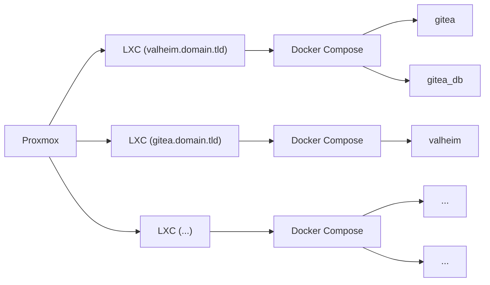

Recently some of my old friends and I started getting back into [Valheim](https://store.steampowered.com/app/892970/Valheim/). Last time we did this we rented out a server from one of the many server providers out there. However, as we've noticed, these servers are prone to really underperforming their listed specs. Since then I have [significantly upgraded]({{ "about" | relative_url }}/#servers) my home lab from a lonely little Raspberry Pi 3B+.

While setting up a Valheim server in itself is not that difficult, especially with the help of docker, until now I've really just been setting up my workflow and this is a chance for me to test it all out.

Now the way I have things currently set up on my main server is that I run LXC containers with Docker running inside these containers for a bit of container-inception. I learned this little technique from a recent [DBTech video](https://www.youtube.com/watch?v=ksvoWpyWHUY).



While options like [Portainer](https://www.portainer.io/) stacks exist for organization, having each "stack" on it's own LXC container makes backuping up and restoring each stack individually a whole lot easier. Instead of having to roll back everything if something goes wrong, I can just pick whichever stack I messed up. All of this at essentially an unnoticable cost to performance.

## Create Proxmox LXC Container

To start, I need to spin up a new LXC container. This is pretty easy in Proxmox.


* We need to give it an ID, 103 in my case was available
* A hostname: valheim.domain.tld, this can really be whatever, but giving it the domain you will access it with helps me for organization
* Deselect "Unprivileged container" this will allow us later to let the Valheim server get more CPU cycles so it feels smoother
* Finally give it a password


* Here I'm choosing a Debian 11.3-1 template from local storage


* Allocate some storage for it. I found that 8GB is enough but 12GB gives some head room for growth


* I've given my container 6 vCores on my Intel 12400, however even with a few people on it I've not managed more than 10% CPU usage


* 8GB RAM is more than enough, at idle it only uses 2.5GB and it barely goes up as people join


* I've selected to use DHCP to get the IP address for this container, I like to set the static routes in my DHCP server (in my case my OPNsense router) to stay organized


* I ignore the DNS tab because I let my DHCP server provide the DNS details the the container


* Finally, set it to start after creating and click confirm

Next, log into the container and I've created a simple install script for myself that installs updates, zsh, oh-my-zsh, and docker

## Install zsh and docker

```shell
apt update && apt upgrade -y && apt install curl zsh git -y && sh -c "$(curl -fsSL https://get.docker.com)" && sh -c "$(curl -fsSL https://raw.github.com/ohmyzsh/ohmyzsh/master/tools/install.sh)" -y
```
</details>