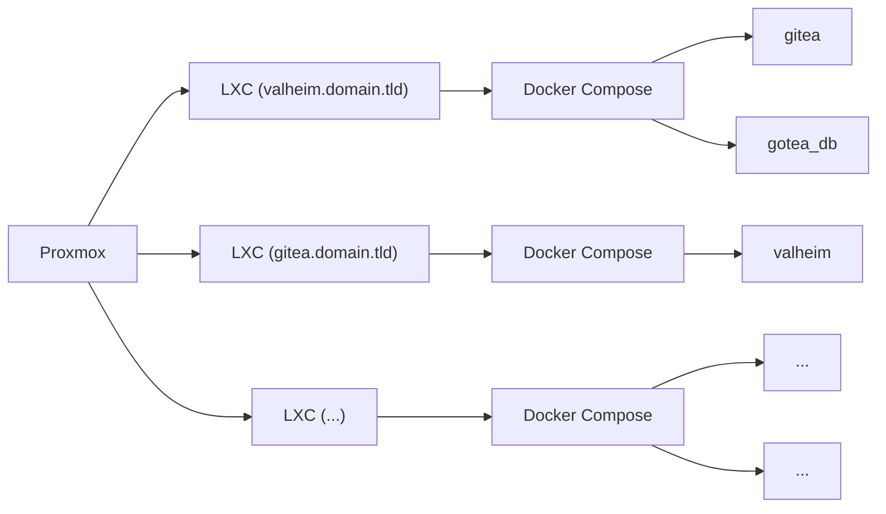

{% assign random = site.time | date: "%s%N" %}

In one of his recent YouTube video, TechnoTim has challeneged all of us Homelabbers to the #100DaysOfHomeLab

The challenge is to commit at least 1 hour for the next 100 days learning or working on or about our homelabs. In this rolling post, I will update each day with what I did and/or what I am learning.

<!--

  

  Day 3: Only allowing Cloudflare's servers onto port 443 of my network
  

  

  

-->

<!--

  

  Day 2: CI with Drone CI and Gitea
  

  

  Well the work for this post actually started in the middle of working on the post for Day 1, but ended today on Day 2. Like any good homelabber I got [nerd sniped](https://xkcd.com/356/) by myself.
  

-->








{{ day.title }}

{{ day.content | markdownify }}

