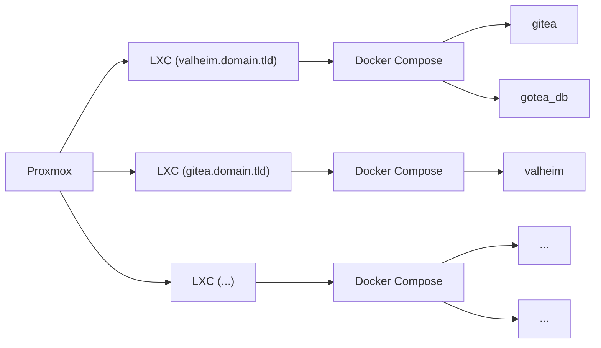

Recently some of my old friends and I started getting back into [Valheim](https://store.steampowered.com/app/892970/Valheim/). Last time we did this we rented out a server from one of the many server providers out there. However, as we've noticed, these servers are prone to really underperforming their listed specs. Since then I have 
[significantly upgraded](https://lder.dev/about/#servers) 
my home lab from a lonely little Raspberry Pi 3B+.

While setting up a Valheim server in itself is not that difficult, especially with the help of docker, until now I've really just been setting up my workflow and this is a chance for me to test it all out.

Now the way I have things currently set up on my main server is that I run LXC containers with Docker running inside these containers for a bit of container-inception. I learned this little technique from a recent [DBTech video](https://www.youtube.com/watch?v=ksvoWpyWHUY).



> If this isn't rendering right it's because there has been an ongoing issue with Mermaid.JS
{: .prompt-info }

While options like [Portainer](https://www.portainer.io/) stacks exist for organization, having each "stack" on it's own LXC container makes backuping up and restoring each stack individually a whole lot easier. Instead of having to roll back everything if something goes wrong, I can just pick whichever stack I messed up. All of this at essentially an unnoticable cost to performance.

## Create Proxmox LXC Container

To start, I need to spin up a new LXC container. This is pretty easy in Proxmox.


* We need to give it an ID, 103 in my case was available
* A hostname: valheim.domain.tld, this can really be whatever, but giving it the domain you will access it with helps me for organization
* Deselect "Unprivileged container" this will allow us later to let the Valheim server get more CPU cycles so it feels smoother
* Finally give it a password


* Here I'm choosing a Debian 11.3-1 template from local storage


* Allocate some storage for it. I found that 8GB is enough but 12GB gives some head room for growth


* I've given my container 6 vCores on my Intel 12400, however even with a few people on it I've not managed more than 10% CPU usage


* 8GB RAM is more than enough, at idle it only uses 2.5GB and it barely goes up as people join


* I've selected to use DHCP to get the IP address for this container, I like to set the static routes in my DHCP server (in my case my OPNsense router) to stay organized


* I ignore the DNS tab because I let my DHCP server provide the DNS details the the container


* Finally, set it to start after creating and click confirm

Next, log into the container and I've created a simple install script for myself that installs updates, zsh, oh-my-zsh, and docker

## Install zsh and docker

```shell
apt update && apt upgrade -y && apt install curl zsh git -y \ 
    && sh -c "$(curl -fsSL https://get.docker.com)" \ 
    && sh -c "$(curl -fsSL https://raw.github.com/ohmyzsh/ohmyzsh/master/tools/install.sh)" -y
```
{: .nolineno }

## Install Valheim

First I'll make the directory where I want to keep the docker compose file.

```shell
mkdir -p docker/valheim && cd docker/valheim
```
{: .nolineno }

and then after a bit of trial and error I came up with this docker-compose.yml file

```yml
version: '3.8'
volumes:
  config:
  data:
services:
  valheim:
    image: lloesche/valheim-server
    container_name: valheim
    environment:
      - PUID=1000
      - PGID=1000
      - SERVER_NAME=AValheimServer
      - WORLD_NAME=AValheimServer
      - SERVER_PASS=dockeriscool
      - SERVER_PUBLIC=true
      - ADMINLIST_IDS=YOUR_STEAM_ID
      - TZ=America/New_York
    ports:
      - 2456:2456/udp
      - 2457:2457/udp
    volumes:
      - config:/config
      - data:/opt/valheim
    cap_add:
      - SYS_NICE
    restart: always
```
{: file="docker-compose.yml" }

Here you'll want to replace `YOUR_STEAM_ID` with your steam ID which can be found on your [steam account page](https://store.steampowered.com/account/), which will make you the server administrator.

I have `SERVER_PUBLIC` set to `true` so I can easily monitor the server status using [Uptime-Kuma](https://github.com/louislam/uptime-kuma).

Once you have this saved, it's as easy as running

```shell
docker compose up -d
```
{: .nolineno }

and it will create and host the server for you. Just port forward ports `2456` and `2457` in your router and you'll be able to connect to it using your public IP. Or you can set up a (un-proxied) DNS record valheim.domain.tld to point to your public IP and connect to it that way.

## Monitoring with Uptime-Kuma

I won't show you how to set up Uptime-Kuma, although it's fairly simple. But this will just be how to monitor your Valheim server using it.

First you'll need a Steam Web API key, you can get one by going here: 

Then you just need to add that to the `Settings: General` page in Uptime-Kuma


Next you'll want to add a new monitor, I called mine `Valheim`. And for the host name you actually want to put your public IP address. For some reason the steam API does not support DNS lookup, this took me a while to figure out. Finally, set the port to `2457`, add any other settings, tags, notifications, etc. and then click save.


If all goes well you should see your server is online.

