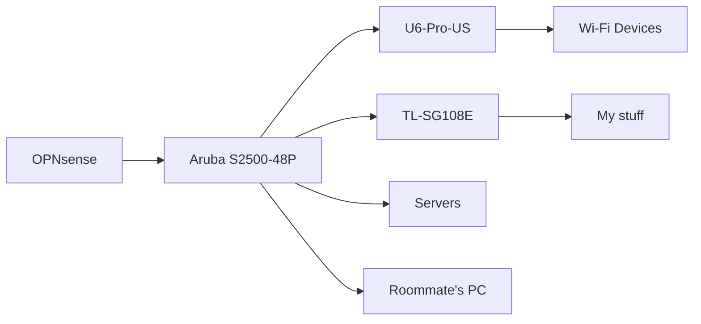

At the beginning of this week I only had a vague idea of what VLANs were, in fact until today I barely had any idea and I'm still learning more as I write this. So you can say me accidentally locking myself out of my internet a few times at midnight or later (because I have roommates who I try not to disturb with my network shenanigans) was a common occurance.

My basic network setup looks vaguely something like this:

> If this isn't rendering right it's because there has been an ongoing issue with Mermaid.JS
{: .prompt-info }

Initially, I had all of these devices on the same network, which for a home network is acceptable but not great. So I finally decided to logically separate my network via VLANs.

My plan was to have these VLANs:

* DMZ: for servers
* Users: Normal network users like my phone and my roommates' devices
* IoT: For internet of things and other devices I don't trust not to try and snoop on what's on my network (looking at you Google/Nest products)
* Guest: Guest network for people who do not visit often

In OPNsense this way pretty easy to set up and I'd really like to thank Mactelecom Networks on YouTube for [this great video](https://www.youtube.com/watch?v=dv13d6rfQPI) that basically gives a great overview on how to set up VLANs in OPNsense. It also gives me some good info on where to get started with my Ubiquiti access point.

However, the issue I ran into was one with my Aruba S2500 switch. I thought I had tried everything. I set up VLANs in the WebUI, I set them up in the command line interface. But every time I tried to enable them I just ended up locking myself out and I couldn't figure out why so I had to give up.

### Update (June 14th, 2022, Day 4)

As of June 14th, 2022, day 4 of #100DaysOfHomeLab, I did actually get VLANs working, at least I think I did. The solution was setting the uplink port (the one that connects to my router) on my Aruba switch to a *trunk port* allowing my VLANs to pass through. To any network admins this probably seems trivial, but at the time for me this was a complete mystery.

And now they work. Currently, I only have the Wi-Fi users separated into VLANs but I'm slowly working on trying to get the wired connections set up along with a "blackhole" vlan on my switches that basically disables the unused ports.